## Introduction
AlumniCarpool is a single-page-components Vue application like Uber; Driver could initialize seats, create orders, and control their status, while passenger could select specified seat and rate the driver in historical orders.

## Demo
Click on the thumbnail to play the demo on Youtube

[](https://www.youtube.com/watch?v=RbdHTSxbPLo)

## Architecture

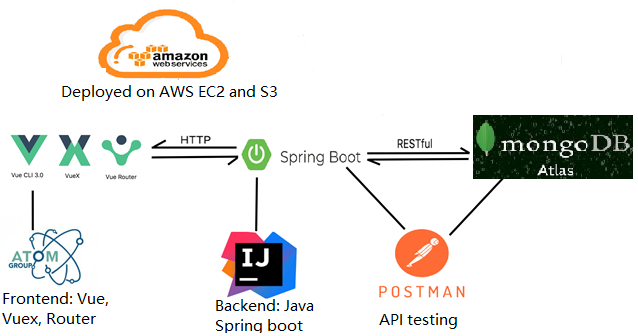

## User manual
Step 1: Sign up, sign in, and update personal profile through “Account settings”. You may upload your avatar, input your seat preference via tags, or upload your alumni certificate.


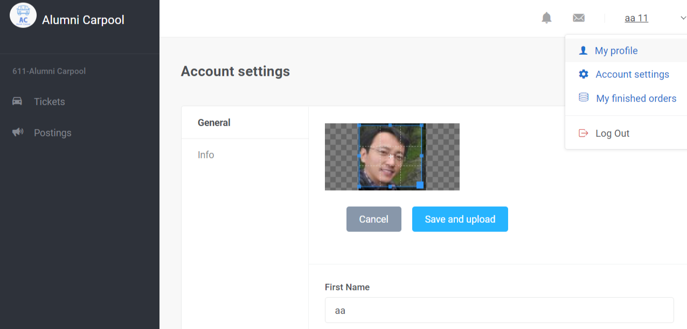
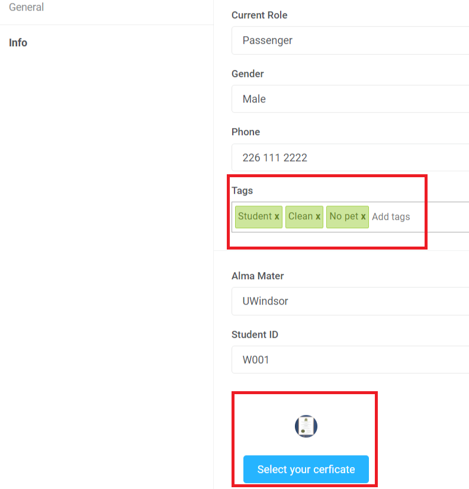

If you sign up as a driver, you can see a “Car Info” tab where you can upload your car photo and customize the seat information which will present in orders later.

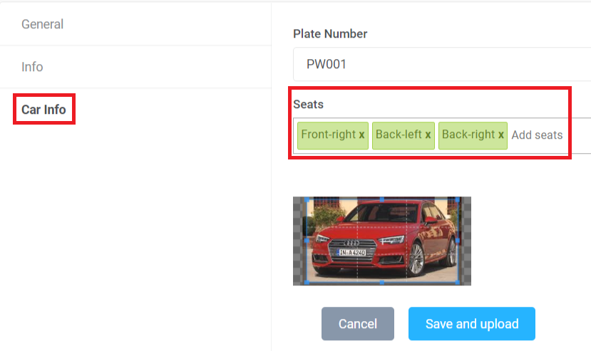

Step 2: Drivers create tickets (orders)

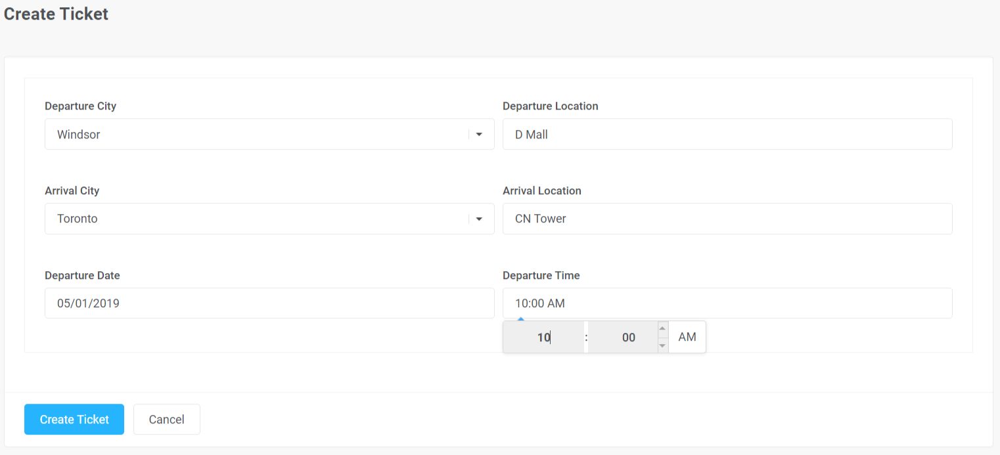

Step 3: Passengers view created tickets and filter them out by departure city, arrival city, and departure date. All fitting tickets will be listed in a data table, which supports pagination, reordering, and search. Clicking on any avatar triggers a model showing an amplified picture of that avatar. Put the mouse on the reserved seat you can see who has reserved it or on a vacant seat presented as a hollow icon you can see the position. Click on that hollow icon to reserve the seat and make the icon changed to a filled one. Click on your reserved seat to cancel your reservation from that order and meantime toggle the icon to a hollow one. You can see the appropriate other tooltips and notifications as well.

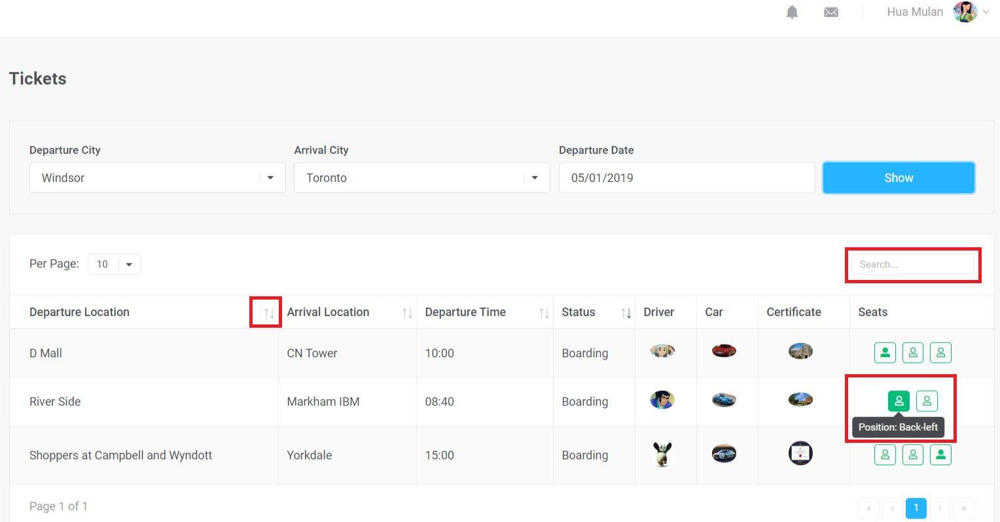
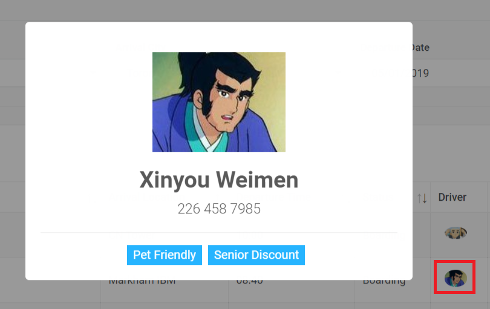
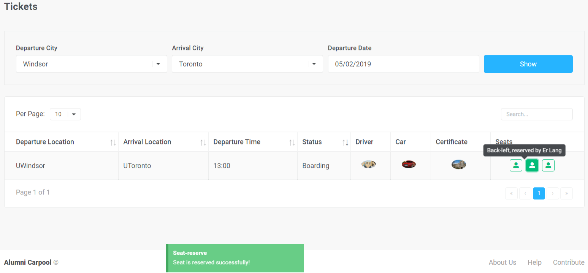
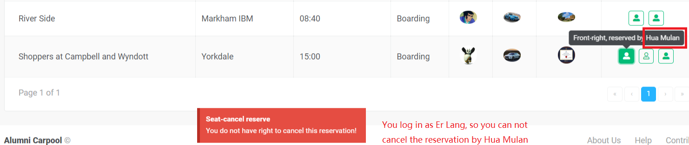

Step 4: Sign in as a driver and filter orders you can see your created order with reserved seats, as well as an operation column. You cannot operate orders created by other drivers. When every seat is reserved, you may want to click on the hollow plane icon to start the journey. At the same time, the order status is changed from original Boarding to On-board, and every passenger in that order will receive a notification from you. When every passenger arrives their destination, you may change the order to Finished by clicking on the filled plane icon, and subsequently the order disappears from the order list. We do not cover a payment module in our application, so do that thing offline.


Step 5: Log in as a passenger you can see the notifications from drivers. Clicking on a message to see its details in a popup model. When you read that message and go back to click on the envelop icon again, you can see the count of the new messages is deducted by 1.

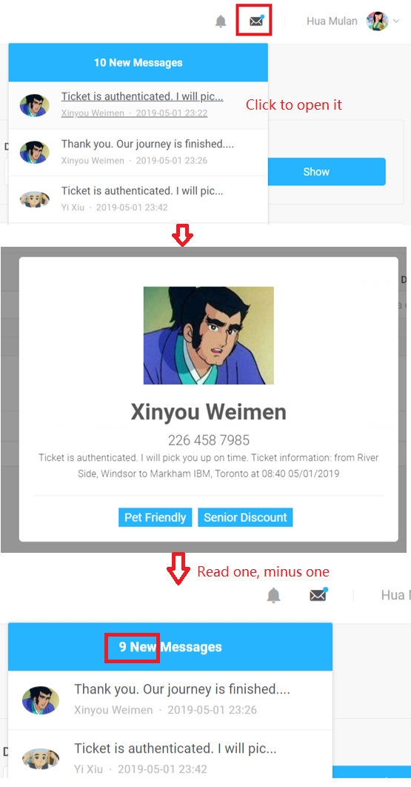

Clicking on “My finished orders” opens a swiper slider where you can find a previous order and rate the driver. A tooltip on the driver’s or the co-passenger’s avatar can help recall their information.

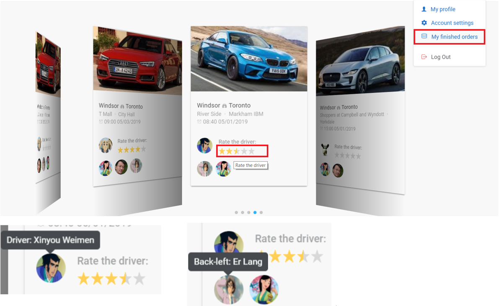

Step 6: Log in as a driver, you can see the notifications from the system and from the passengers.

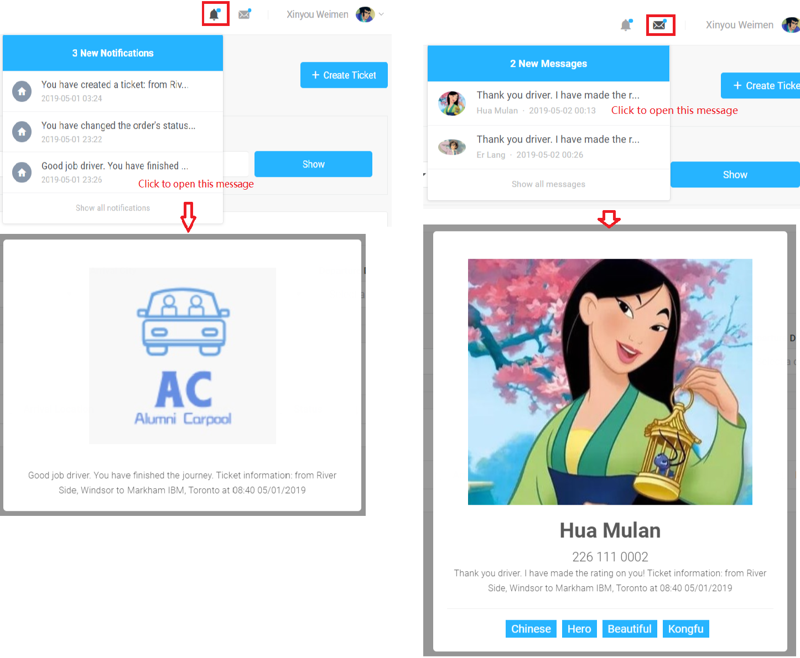

Click on “My profile” to review your current overall rating based on all your passengers.

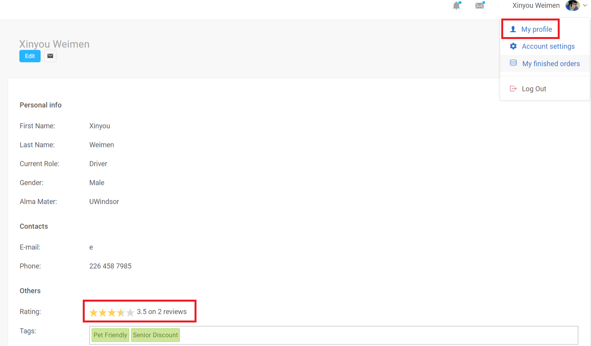

Click on “My finished orders” to view your previous orders. As a driver, you cannot rate yourself while you see information of all your passengers.

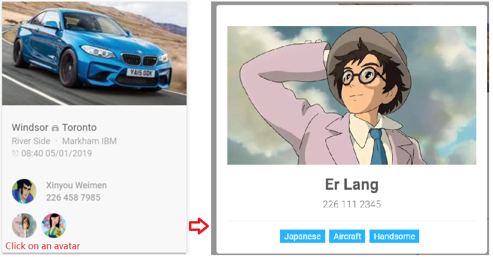

Step 7: As a passenger, you can also create a posting indicating your departure and destination to let the driver call you offline. You will delete your posting when you are picked up by a driver or when you want to change your schedule.

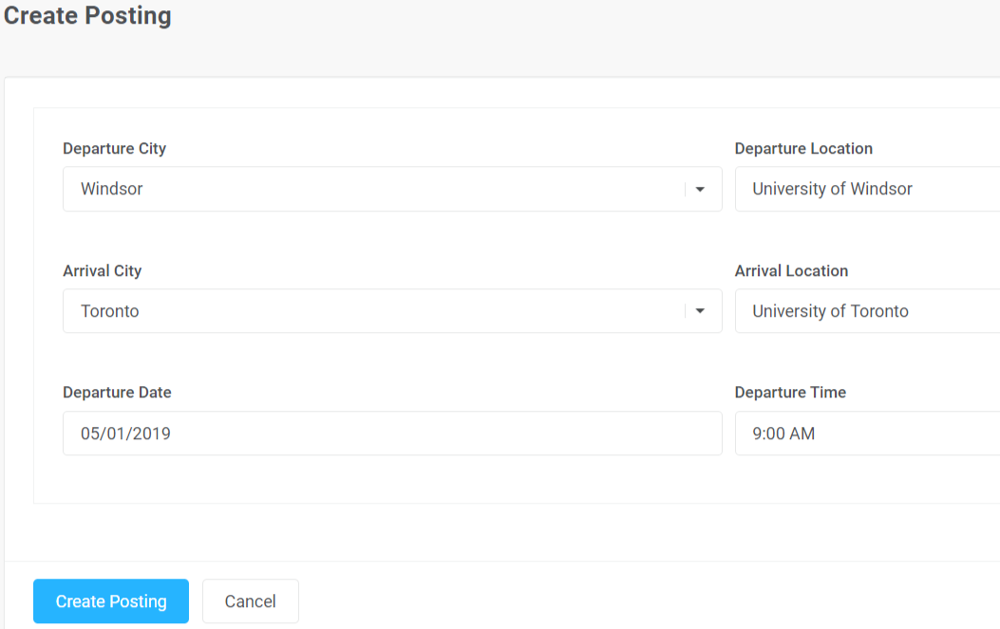
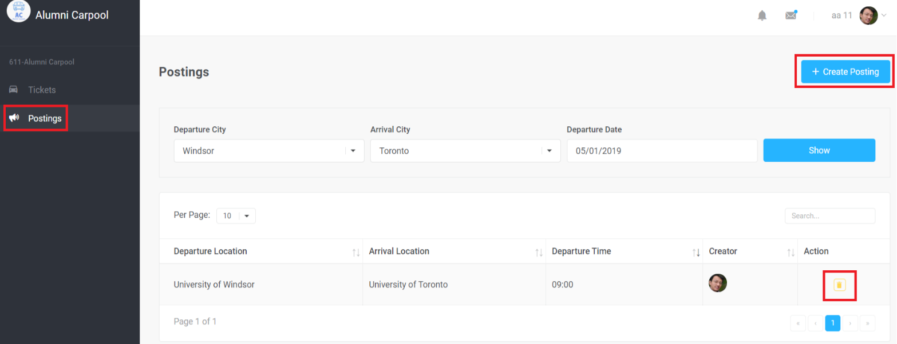

## Deployment:
Change the dataUrl in the main.js file to deploy the application locally or on AWS EC2.
Step 1: frontend server
```
Git clone https://github.com/suot/alumniCarpool-frontend.git
```
```
npm install
```
```
npm install node-sass
```
```
npm run serve
```

Step 2: backend server
```
Git clone https://github.com/suot/alumniCarpool-backend.git
```
Run in intelliJ via the embedded tomcat in Spring boot project, or generate a war package and put it into provided tomcat server.

## Technical details with code snapshots
1.	Model definition referring to MongoDB collection users, query using MongoRepository Adapter, and Restful API in controller

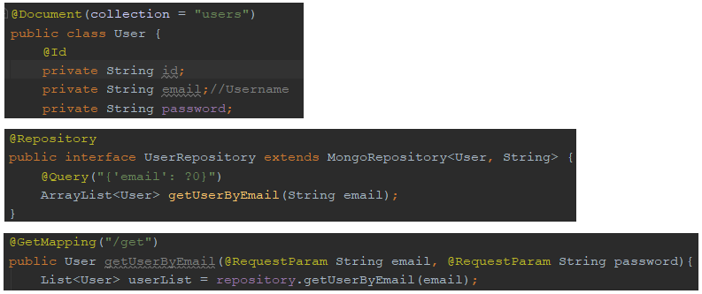

2.	Interaction between frontend (Vue) and backend server (Spring boot): Http Get/Post/Put/Delete requests are all used to consume backend APIs. Post is used when creating a new record and Put is used for updating record.

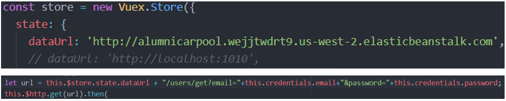

3.	Authentication: password is encrypted in backend using BCryptPasswordEncoder and hashed in MongoDB. Hash match is used to verify password and if it does not match the hashed password in DB, an error notification will be shown on screen.

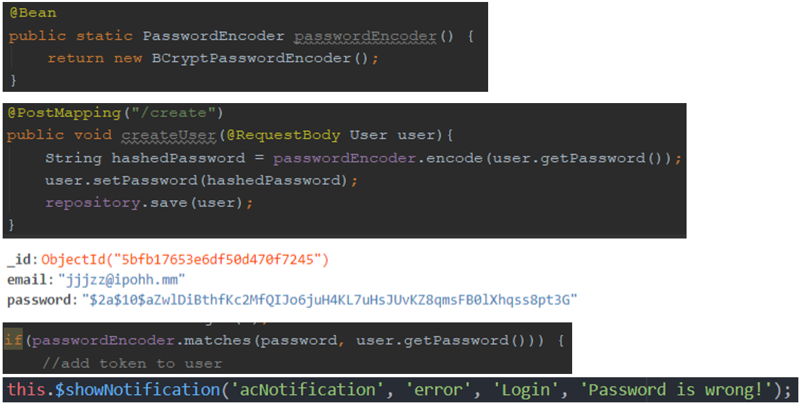

4.	Authorization: Different roles see different elements and actions, for example: a driver can create ticket while a passenger can reserve a seat; Passenger A can cancel his/her own reserved ticket but has no right to cancel passenger B’s; Passenger can rate a driver using the 5-star rating plugin while a driver can only see the ratings. Authorization is controlled in the frontend via the “v-if” syntax

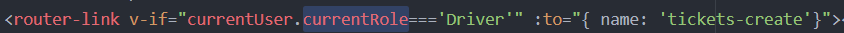

5.	Routers in frontend: when refreshing a webpage or accessing a URL without authentication, the user will be redirected to the login page, which is done by the router security in Vue.

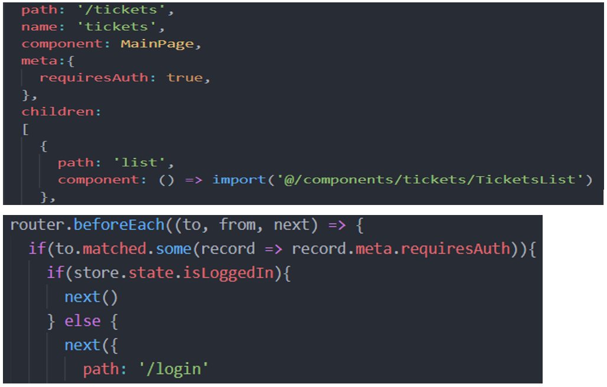

6.	Global states’ tracing using Vuex and Mixin:

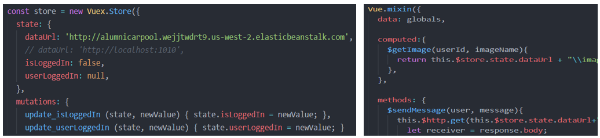

## Lessons learnt from this project
1. MongoDB, as a kind of Nosql Database, is convenient to use and maintain. No sql data table is needed, and no CRUD statements are needed when operating the DAO tier in backend code.

2. The way to generate token/session to avoid csrf (Cross-site request forgery) attack is always challenging. In spring boot security, csrf is opened by default, therefore token is required in http request headers. Otherwise, only Http get is supported. To use the post, put, and delete requests, you have to disable the csrf swift (not recommended, but easy to go at the beginning of a project) or request with token.

3. To allow cross origin, just include the annotation @CrossOrigin in controllers for simplification.

4. When using BCrypt to hash/match password, write the @bean in security file and @Autowired the PasswordEncoder in service or controller file. Do not add duplicate BCryptPasswordEncoder beans in service files, otherwise exception may occur, saying “encode does not like BCrypt…”

5. Vue is cool and easy to learn for basic usage, while single-page component is a more common way in bigger projects and it always involves longer study or preparation to start.

6. Vue Router is an easy way of routing and Vuex is a tool for global state control or global methods definition.

7. AWS Elastic Beanstalk is an easy way for deploying web applications with war or zip package. While AWS Amplify, together with S3, supports Angular/Vue/React much better. Do not use AWS Lightsails. It is a remote virtual machine, but the speed to operate on it is too slow to tolerant when you use the free trial. Use EC2 instead.

8. Testing is important in every stage. Even you have fixed all reported bugs in the final development stage, you may find bugs after deploying the app in cloud.
